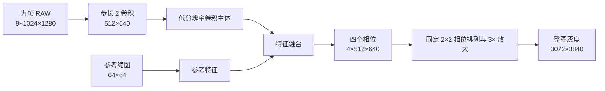

# SS928 五类场景半分辨率模型验证与交付

日期：2026-09-29。目标是让日间普通、轻度、中度、重度和 C32 五类模型的服务器 GPU 推理时间达到现有夜间模型的量级，同时继续压低连续帧闪烁，并给板端提供可定位耗时的完整图和阶段图。

## 模型结构

轻度和中度共用一套权重；重度和 C32 共用一套权重。日间另用一套权重。日间模型在四相位输出上叠加当前 RAW 的对应相位，以保留细节。每类部署图内的参考区域参数已固定；C32 使用自己的区域参数，不与普通重度混用。

夜间普通和特殊继续使用 `releases/ss928-night-nine-v12-layout-20260929/`。对夜间也训练并测试过同一半分辨率结构，其普通和特殊测试 PSNR 分别为 12.59 和 20.84 dB，明显低于现用夜间模型的 27.86 和 25.86 dB，因此未替换夜间模型。

## 五类测试集结果

GPU 时间为 RTX 5090 上完整 1024×1280 九帧输入至 3072×3840 输出的 `torch.compile` 半精度模型测试：预热后 300 次 CUDA 事件计时，关闭 CUDA 图和 TF32。每类 PSNR 使用独立测试集 12 帧。轻度与中度共用同一次 GPU 模型测速；重度与 C32 同理。

| 场景 | 权重 | PSNR dB | GPU 均值 ms | GPU P95 ms | 120 帧静态残差变化，灰度 | 运动响应比 |
|---|---|---:|---:|---:|---:|---:|
| 日间普通 | `day_nine_temporal_half.pt` | 25.497 | 0.3374 | 0.3397 | 1.745 | 0.334 |
| 轻度 | `light_balanced_half.pt` | 34.303 | 0.2229 | 0.2249 | 0.892 | 0.468 |
| 中度 | `light_balanced_half.pt` | 33.782 | 0.2229 | 0.2249 | 0.884 | 0.475 |
| 重度 | `heavy_balanced_half.pt` | 30.330 | 0.2223 | 0.2254 | 1.506 | 0.532 |
| C32 | `heavy_balanced_half.pt` | 23.700 | 0.2223 | 0.2254 | 1.624 | 0.703 |

天气两套权重在原半分辨率模型基础上用成对帧时序损失续训，并按 0.5 比例插值。相比续训前模型，静态残差变化下降约 0.08～0.10 灰度；运动响应下降约 0.04。C32 测试 PSNR 下降约 0.20 dB。所有指标仍需结合整图视频检查结构和弱目标。

日间稳帧候选使用九帧，原九帧模型的静态残差变化为 1.816 灰度，续训后为 1.745；弱结构时序误差从 3.303 降到 3.115，运动响应从 0.341 降到 0.334，测试 PSNR 从 25.709 降到 25.497 dB。对照的旧日间模型静态残差变化为 1.718、运动响应为 0.425；新稳帧候选在这两项上仍未同时达到旧版。保留 `day_rawskip_half.pt` 画质候选：GPU 0.3051 ms、测试 PSNR 26.091 dB、静态残差变化 1.912、运动响应 0.395。它的输出细节和稳帧结果分别见两段日间整图视频。上述静态残差、弱结构误差及运动响应来自同一条测试序列的完整 120 帧，数值越小的前两项代表时序误差越低；运动响应需结合 GT 和视频判断。

## 板端测试图

`onnx/final/<场景>/` 各含三张图及校验清单：

- `*_rows32.onnx`：完整 3072×3840 输出，固定 32 行铺排；优先作为候选。
- `*_nearest.onnx`：完整同尺寸输出，用于与行铺排方案比较。
- `*_phases.onnx`：四相位 4×512×640 输出，用于量出大尺寸输出布局的耗时；它不是完整显示图。

导出时 `rows32` 与 `nearest` 的输出最大绝对差为 0，五类 ONNX 文件哈希均与清单相符。日间 `rows32` 经 ONNX Runtime 与 PyTorch 探针对照，灰度平均绝对差为 0.0000133，最大差 0.000145。板端编译、量化误差及 NPU 时间仍未实测。v0.11 夜间报告记录普通 24.354 ms、特殊 22.510 ms 的独立 NPU 均值，并指出大尺寸输出布局和 Report 转换约占 12.7 ms；这两项是本轮完整图和四相位图需要分段定位的原因。GPU 时间不能换算为 SS928 时间。

## 文件与复现

- `models/`：三套五类稳帧权重，以及日间画质候选；保留的其他模型仅供复核实验。
- `onnx/final/`：五类、每类三张静态 ONNX 图。
- `onnx/alternate_day_quality/`：日间画质候选的三张图，用来对照稳帧候选。
- `records/`：测试集逐帧质量、GPU 计时与 120 帧时序测量原始 JSON。
- `videos/`：五类完整 120 帧整图三栏对照视频，依次为输入、模型结果、GT。
- `runtime/`：本轮训练、导出、验证、渲染的源码快照；依赖现有仓库 `src/ir_sr` 和既有夜间运行时代码。

视频编码为 5120×1080、120 帧，展示的是完整画面缩放后的三栏对照，未裁成局部。五类稳帧视频位于 `videos/final/`，日间画质候选在 `videos/day_quality_option.mp4`。所有候选权重和视频均保留原版本，不覆盖。

训练服务器所用 `src/ir_sr` 代码提交为 `0c1f674d7b5f1d1aed8e75ac64082c97e0dedc9e`，训练脚本 SHA-256 为 `46786c7c85ca1b94f434889d14dc52d49d2878d42cdc76f48f10c1ff9283ae02`；复现需使用训练缓存、教师权重和数据集的原始路径，详见各 JSON 中的检查点和样本记录。
